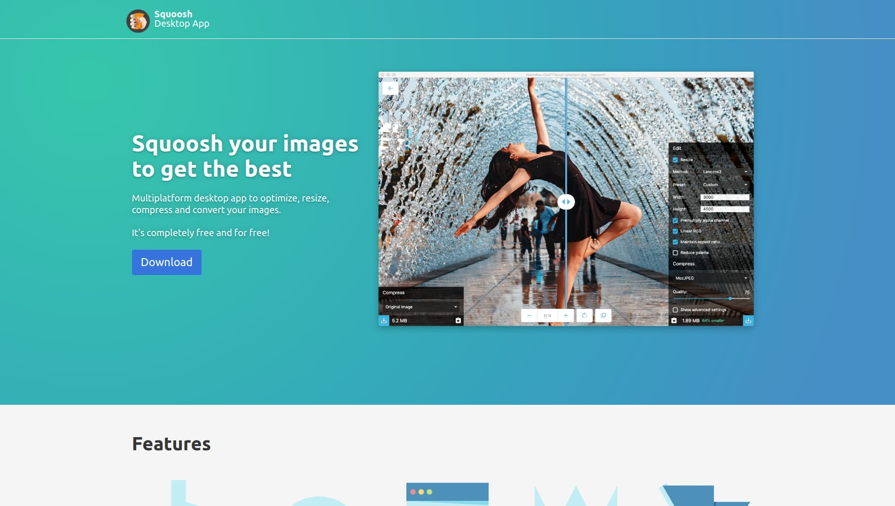

## Website for the Squoosh Desktop App project

This is a website for the multiplatform desktop app to compress, resize, and crop your images.
You can see in production: [https://squoosh-desktop.now.sh/](https://squoosh-desktop.now.sh/)

## More info

Squoosh Desktop App is an port based on Electron and working 100% offline of the online version of [Squosh.app](https://squoosh.app). Squoosh is and open source product made by the GoogleChromeLabs. The desktop app is a project of [Matias Benedetto](http://mebenedetto.com)

## Technologies

The website was developed using NextJS, React, Sass and deployed on Now.

## Development

Run development enviroment

`npm run dev`

Deploy

`now`

## Contribute
If you want to contribute to the feel free to make a Pull Request improving the codebase.
